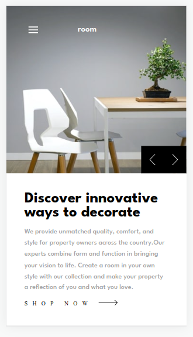

# Frontend Mentor - Room homepage solution

This is a solution to the [Room homepage challenge on Frontend Mentor](https://www.frontendmentor.io/challenges/room-homepage-BtdBY_ENq). Frontend Mentor challenges help you improve your coding skills by building realistic projects. 

## Table of contents

- [Overview](#overview)
  - [The challenge](#the-challenge)
  - [Screenshot](#screenshot)
  - [Links](#links)
- [My process](#my-process)
  - [Built with](#built-with)
  - [What I learned](#what-i-learned)
  - [Continued development](#continued-development)
  - [Useful resources](#useful-resources)
- [Author](#author)

## Overview
This is a solution to the [Room homepage challenge on Frontend Mentor](https://www.frontendmentor.io/challenges/room-homepage-BtdBY_ENq).

### The challenge

Users should be able to:

- View the optimal layout for the site depending on their device's screen size
- See hover states for all interactive elements on the page
- Navigate the slider using either their mouse/trackpad or keyboard

### Screenshot




### Links

- Solution URL: [Add solution URL here](https://your-solution-url.com)
- Live Site URL: [Add live site URL here](https://your-live-site-url.com)

## My process
- i started by finding out ways i can come up with the solution to challege.
- i worked first on the desktop view ,the tablet and at last mobile view
### Built with

- Semantic HTML5 markup
- CSS custom properties
- Flexbox
- desktop-first workflow

### What I learned
- I learned on how to use the pseudo elements.
- I also learned on how to generate data dynamically to my html elements.

```css
.nav-list ul li::after{
    content: "";
    width: 0%;
    height: 2px;
    background-color: hsl(0, 0%, 100%);
    margin-top: 10px;
    position: absolute;
    bottom: -2px;
    left: 0px;
    transition: width 300ms ease-in-out;
}
```
```js
let dataText = [{
    mobile_imgUrl: "./images/mobile-image-hero-1.jpg",
    desktop_imgUrl: "./images/desktop-image-hero-1.jpg",
    title: "Discover innovative ways to decorate",
    description: "We provide unmatched quality, comfort, and style for property owners across the country.Our experts combine form and function in bringing your vision to life. Create a room in your own style with our collection and make your property a reflection of you and what you love."
},
{
    mobile_imgUrl: "./images/mobile-image-hero-2.jpg",
    desktop_imgUrl: "./images/desktop-image-hero-2.jpg",
    title: "We are available all across the globe",
    description: "With stores all over the world, it's easy for you to find furniture for your home or place of business.Locally, we’re in most major cities throughout the country. Find the branch nearest you using our store locator. Any questions? Don't hesitate to contact us today."
    },
{
    mobile_imgUrl: "./images/mobile-image-hero-3.jpg",
    desktop_imgUrl: "./images/desktop-image-hero-3.jpg",
    title: "Manufactured with the best materials",
    description: "Our modern furniture store provide a high level of quality. Our company has invested in advanced technology to ensure that every product is made as perfect and as consistent as possible. With three decades of experience in this industry, we understand what customers want for their home and office."
    }];
    
    
left.addEventListener("click",()=>{
    count--;
if(count<0){
    count = dataText.length-1;
}
    source1.attributes.srcset.nodeValue = dataText[count].desktop_imgUrl;
    source2.attributes.srcset.nodeValue = dataText[count].mobile_imgUrl;
    srcImage.attributes.src.nodeValue = dataText[count].desktop_imgUrl;

    title.innerHTML = dataText[count].title;
    description.innerHTML = dataText[count].description;
})


right.addEventListener("click",()=>{
    count++;
    if(count==dataText.length){
        count=0;
    }
    source1.attributes.srcset.nodeValue = dataText[count].desktop_imgUrl;
    source2.attributes.srcset.nodeValue = dataText[count].mobile_imgUrl;
    srcImage.attributes.src.nodeValue = dataText[count].desktop_imgUrl;

    title.innerHTML = dataText[count].title;
    description.innerHTML = dataText[count].description;
    })
```

### Continued development

- animations
- reactjs
- api

## Author

- Frontend Mentor - [Fred Zabulon](https://www.frontendmentor.io/profile/fredzabu)
- Twitter - [Fred Zabulon](https://www.twitter.com/Asiimwefred20)

